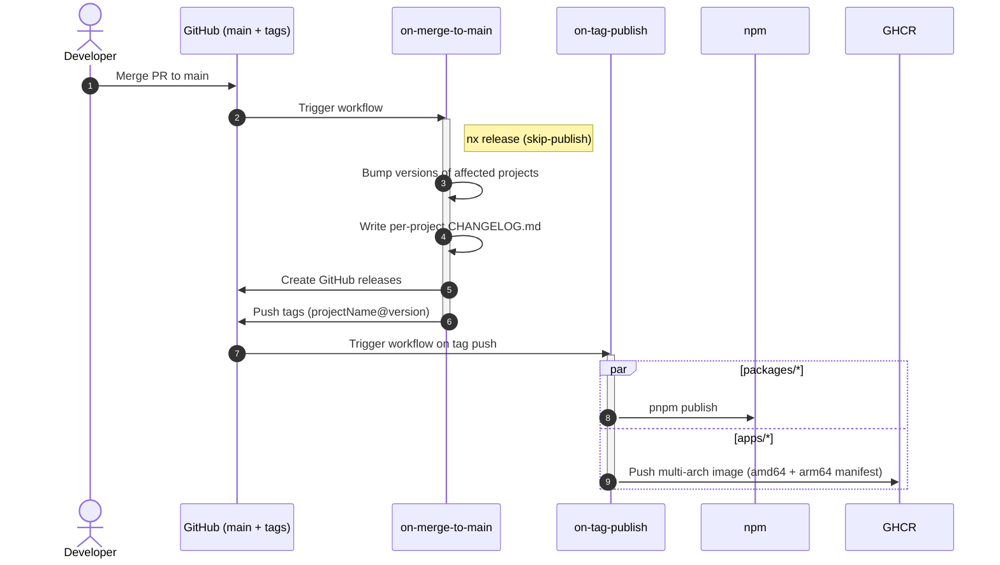

# Release and deployment

Fortuna ships independently versioned projects from a single repo. Conventional Commits drive everything: version bumps, changelogs, and what gets published.

The full rationale is in [ADR-0006](./architecture/decisions/0006-conventional-commits-and-nx-driven-release.md). This page is the operational reference.

## The pipeline at a glance



The release commit itself contains `[skip release]` so the workflow does not loop.

## Commit messages drive everything

Every commit on `main` must follow [Conventional Commits](https://www.conventionalcommits.org/). `commitlint` validates this on every PR. The commit type is what nx-release looks at:

| Type                     | Effect                                  |
|--------------------------|------------------------------------------|
| `feat`                   | minor version bump                       |
| `fix`, `perf`, `refactor`| patch version bump                       |
| `feat!` / `BREAKING CHANGE` | major version bump                    |
| `docs`, `chore`, `ci`, `style`, `test`, `build` | no version bump      |

Scopes (e.g., `feat(api): …`) are encouraged for clarity but don't change behavior.

## Tag and release format

- Tags: `{projectName}@{version}` (for example `api@1.4.0`, `web@0.3.0`, `@fortuna/config@0.2.1`).
- GitHub releases are created per project with rendered changelogs that include authors and commit references.

## CI environment variables

Every compose service reads from a single `.env` at the repo root. Each `environment:` block in `docker-compose*.yaml` interpolates the keys it needs via `${VAR:?required}`, so missing keys fail loudly when compose validates the file.

`.env.example` carries dev-safe defaults for every key, so CI jobs that don't need real secrets can boot the stack with:

```yaml
- name: Write root .env
  run: cp .env.example .env
```

That works for `e2e-tests` (mock-oauth2-server replaces real Google OAuth, ephemeral postgres/redis are happy with the dev creds) and `migration-check` (ephemeral postgres, no real secrets needed). The current PR-check workflow therefore requires zero GitHub-side configuration.

A future real-deployment job would write `.env` from GitHub secrets the same way, just overriding the keys that matter (`POSTGRES_PASSWORD`, `GOOGLE_CLIENT_SECRET`, `GF_SECURITY_ADMIN_PASSWORD`, etc.) — the variable name in GitHub equals the name in `.env` equals the name compose interpolates equals the name the source code reads.

When adding a new env var:

1. Add it to `.env.example` with a sensible dev default.
2. Reference it from the relevant service's `environment:` block in each `docker-compose*.yaml` that needs it via `${VAR:?required}`.
3. For real secrets in real deployments, override in the deployment's `.env`.

## Auxiliary Docker base images

Two base images speed up local and CI builds:

- `ghcr.io/emiliosheinz/fortuna-cli` — Node + pnpm + git + curl. Backs the `workspace` and `setup` compose services.
- `ghcr.io/emiliosheinz/fortuna-playwright` — Node + pre-installed Playwright browsers (chromium, firefox, webkit). Backs the e2e Dockerfiles.

They are rebuilt automatically by `build-auxiliary-docker-images.yml` whenever the corresponding `docker/Dockerfile.*` changes on `main`. Multi-arch (`linux/amd64,linux/arm64`) is published in a single job using QEMU + Buildx.
