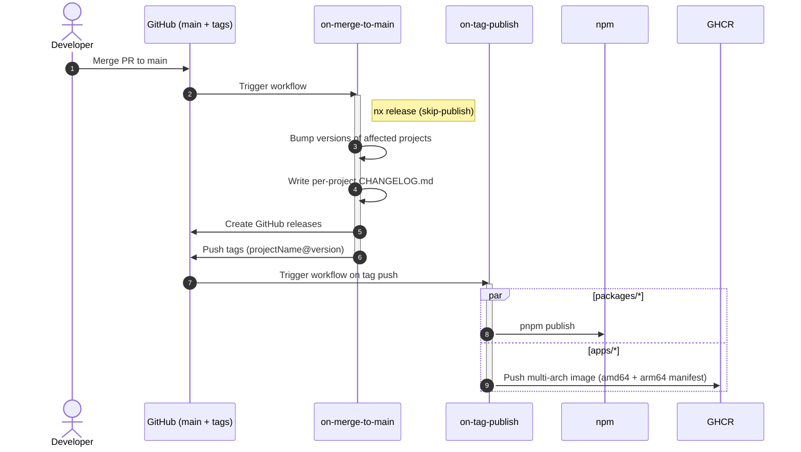

# Release and deployment

Fortuna ships independently versioned projects from a single repo. Conventional Commits drive everything: version bumps, changelogs, and what gets published.

The full rationale is in [ADR-0006](./architecture/decisions/0006-conventional-commits-and-nx-driven-release.md). This page is the operational reference.

## The pipeline at a glance

The release commit itself contains `[skip release]` so the workflow does not loop.

## Commit messages drive everything

Every commit on `main` must follow [Conventional Commits](https://www.conventionalcommits.org/). `commitlint` validates this on every PR. The commit type is what nx-release looks at:

| Type                     | Effect                                  |
|--------------------------|------------------------------------------|
| `feat`                   | minor version bump                       |
| `fix`, `perf`, `refactor`| patch version bump                       |
| `feat!` / `BREAKING CHANGE` | major version bump                    |
| `docs`, `chore`, `ci`, `style`, `test`, `build` | no version bump      |

Scopes (e.g., `feat(api): …`) are encouraged for clarity but don't change behavior.

## Tag and release format

- Tags: `{projectName}@{version}` (for example `api@1.4.0`, `web@0.3.0`, `@fortuna/config@0.2.1`).
- GitHub releases are created per project with rendered changelogs that include authors and commit references.

## CI environment variables

Per-app `.env` files are required by every compose service. In CI the values come from GitHub Actions vars/secrets, assembled by a composite action:

- `.github/actions/assemble-env/` reads `apps/<app>/.env.example` (or `.env.example` at repo root for `root`) and writes the corresponding `.env`.
- Required env vars use a prefix scheme: for each `KEY` in `.env.example`, the action reads `${PREFIX}_${KEY}` from the workflow environment.
  - `apps/web/.env.example` → prefix `WEB_` (e.g. `WEB_PORT`, `WEB_HOST`).
  - `apps/api/.env.example` → prefix `API_` (e.g. `API_DB_HOST`, `API_DB_PASSWORD`).
  - Root `.env.example` → prefix `ROOT_` (e.g. `ROOT_POSTGRES_USER`).
- If any required prefixed var is missing, the action lists every missing variable before exiting non-zero. CI fails loudly rather than silently shipping with blanks.
- The `migration-check` job uses `ROOT_POSTGRES_*` as the source of truth for database credentials and derives `API_DB_*` from them — there's one credential, not two.

When adding a new env var:

1. Add it to the relevant `.env.example` so it's picked up locally by `scripts/setup-env.sh`.
2. Add `${PREFIX}_${KEY}` as a GitHub Actions variable or secret, then reference it in the workflow `env:` block.

## Auxiliary Docker base images

Two base images speed up local and CI builds:

- `ghcr.io/emiliosheinz/fortuna-cli` — Node + pnpm + git + curl. Backs the `workspace` and `setup` compose services.
- `ghcr.io/emiliosheinz/fortuna-playwright` — Node + pre-installed Playwright browsers (chromium, firefox, webkit). Backs the e2e Dockerfiles.

They are rebuilt automatically by `build-auxiliary-docker-images.yml` whenever the corresponding `docker/Dockerfile.*` changes on `main`. Multi-arch (`linux/amd64,linux/arm64`) is published in a single job using QEMU + Buildx.
